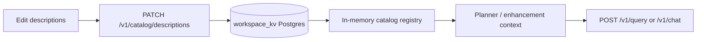

# Catalog curation loop

Operators improve NL→SQL grounding by editing **table descriptions** in the data catalog. Saved text is merged into the live catalog registry and used on the **next** query or chat turn — no API restart.

## Flow



1. **Introspection** builds `config/catalog.yaml` (column names, types, optional YAML descriptions).
2. **Overrides** from the dashboard or `PATCH /v1/catalog/descriptions` are stored in `seal_app.workspace_kv` and applied on startup and after each save.
3. **`POST /v1/catalog/sync`** regenerates YAML from the database schema. User overrides in Postgres are **re-applied** after sync (`preserved` count in the sync response).
4. The planner and enhancement chain read descriptions from the **in-memory registry** when building prompt context.

## Operator checklist

| Step | Where | What to expect |
| ---- | ----- | -------------- |
| Edit | Dashboard **Catalog** (port 3001) or API | Tables use `table_description`; views/matviews/caggs use `view_description` — unsaved rows show an **Unsaved** badge |
| Save | **Save descriptions** | Toast + banner: active for next query/chat |
| Verify | **Query** or **Chat** | Better table selection; with trust explainability on, `catalog_matches` in metadata |
| Sync after migration | **Sync from DB** | YAML rebuilt; Postgres overrides preserved |

## API

```bash
# List merged catalog (YAML + overrides)
curl -H "X-API-Key: $SEAL_API_KEY" http://localhost:8000/v1/catalog

# Persist overrides (survives sync)
curl -X PATCH -H "Content-Type: application/json" -H "X-API-Key: $SEAL_API_KEY" \
  -d '{"tables":[{"schema":"public","name":"orders","table_description":"Customer purchase orders with amounts and status"}]}' \
  http://localhost:8000/v1/catalog/descriptions
```

## Docs site

User-facing walkthrough: `/docs/data-catalog` on the docs app (port 3000).
